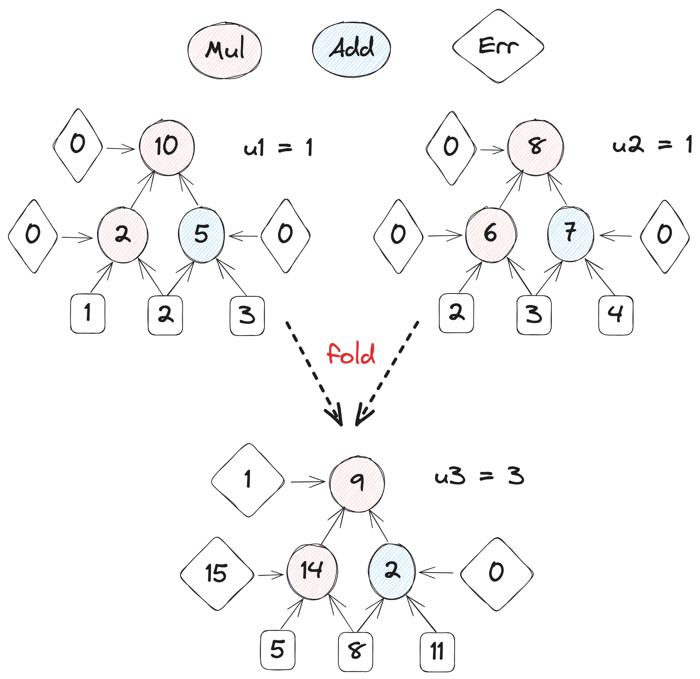

# PNova

As we know [the original Nova implementation](https://github.com/microsoft/Nova)  is based on R1CS. Our target is to implement a plonkish versioned NOVA, folding multiple Customer Gate/Lookup instances into one respectively. Thereafter, we can feed the folded instances into the relaxed Plonk SNARK.

 

##  Intuition About Plonkish Nova

 

## Details About Implementation

Before intensive coding we will give more comprehensive details as much as possible, including some attestation code:
- [Thinking in Folding Scheme: Cross Term in R1CS](https://hackmd.io/@70xfCGp1QViTYYJh3AMrQg/BJZPMjIfT)
- [Thinking in Folding Scheme: Cross Term in Plonk](https://hackmd.io/@70xfCGp1QViTYYJh3AMrQg/SkDf2nIzp)
- [Thinking in Folding Scheme: Cycle Curves](https://hackmd.io/@70xfCGp1QViTYYJh3AMrQg/r1bN8nLMp)
- [Plonk From Scratch](https://hackmd.io/@70xfCGp1QViTYYJh3AMrQg/HJzwPUU7a)

 

## Roadmap

| Features                                         | Status  |                                      Repo                                      |                                        Doc                                        |
| ------------------------------------------------ | :-----: | :----------------------------------------------------------------------------: | :-------------------------------------------------------------------------------: |
| **Stage One**                                    |         |                                                                                |                                                                                   |
| Uncompressed Relaxed UltraPlonk Backend/Frontend | Ongoing | [relaxed-stage-1](https://github.com/ZKMod-Lab/jellyfish/tree/relaxed-stage-1) | [Relaxed Plonk Step by Step](https://hackmd.io/@70xfCGp1QViTYYJh3AMrQg/BkT0ayKmT) |
| Compressed Relaxed UltraPlonk Backend/Frontend   | Ongoing |                                                                                |                                                                                   |
| **Stage Two**                                    |         |                                                                                |                                                                                   |
| Uncompressed NIFS                                |  TODO   |                                                                                |                                                                                   |
| Uncompressed Cycle-Curve Circuits                |  TODO   |                                                                                |                                                                                   |
| Support PLookup/LogUp Folding                    |  TODO   |                                                                                |                                                                                   |
| **Stage Three**                                  |         |                                                                                |                                                                                   |
| compressed NIFS                                  |  TODO   |                                                                                |                                                                                   |
| Compressed Cycle-Curve Circuits                  |  TODO   |                                                                                |                                                                                   |
| **Stage Four**                                   |         |                                                                                |                                                                                   |
| Cycle-fold Delegated Circuit                     |  TODO   |                                                                                |                                                                                   |
| Improving logUp Argument with GKR                |  TODO   |                                                                                |                                                                                   |
| Memory Check Based Lookup Argument               |  TODO   |                                                                                |                                                                                   |
| GKR Based Permutation Check                      |  TODO   |                                                                                |                                                                                   |
 

## Progress of Specific Task
| Day      | Task                             | Status       |
| -------- | -------------------------------- | ------------ |
| 11/08/23 | Relaxed Plonk / Data Structure   | $\checkmark$ |
| 11/10/23 | Relaxed Plonk / Frontend Dev     | $\checkmark$ |
| 11/12/23 | Relaxed Plonk / Frontend Testing | $\checkmark$ |
| 11/15/23 | Relaxed Plonk / Backend Dev      | $\checkmark$ |
| 11/16/23 | Relaxed Plonk / Backend Testing  | -            |

 

## References
[1] NOVA: https://eprint.iacr.org/2021/370.pdf

[2] CycleFold: https://eprint.iacr.org/2023/1192.pdf

[3] Protostar: https://eprint.iacr.org/2023/620.pdf

[4] Multivariate lookup: https://eprint.iacr.org/2022/1530.pdf

[5] Cached quotients: https://eprint.iacr.org/2022/1763.pdf

[6] Improving logUp argument with GKR: https://eprint.iacr.org/2023/1284.pdf